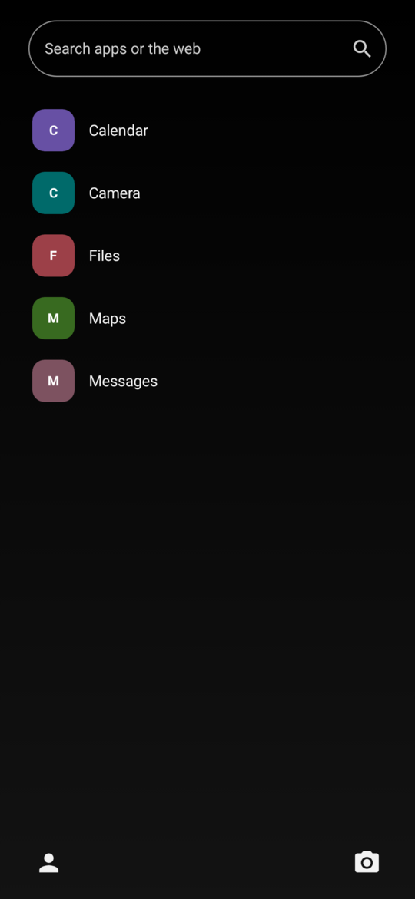
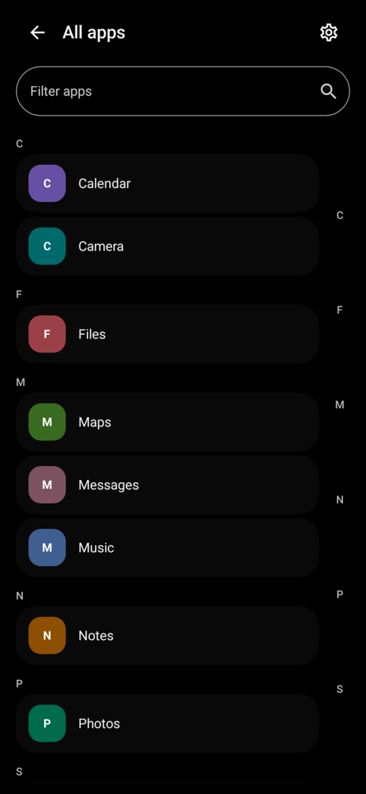
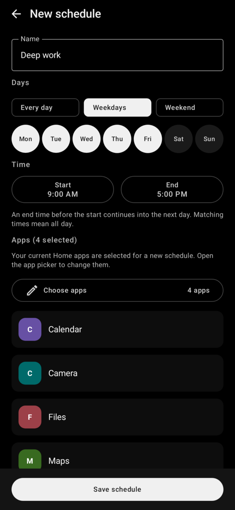
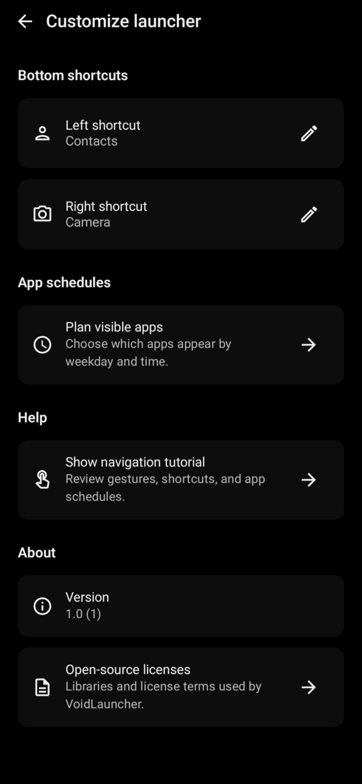

<p align="center">
  
</p>

<h1 align="center">VoidLauncher</h1>

<p align="center">
  An Android launcher for choosing what deserves space on Home.
</p>

<p align="center">
  
  
  
</p>

## See it in use

<table>
  <tr>
    <td width="25%"></td>
    <td width="25%"></td>
    <td width="25%"></td>
    <td width="25%"></td>
  </tr>
  <tr>
    <td align="center"><sub>Home keeps the noise down.</sub></td>
    <td align="center"><sub>Every app stays one action away.</sub></td>
    <td align="center"><sub>Schedules choose what appears and when.</sub></td>
    <td align="center"><sub>Bottom shortcuts stay configurable.</sub></td>
  </tr>
</table>

## The idea

Most launchers treat every installed app as equally urgent. VoidLauncher does not.

Home is a short list that you control. The complete app drawer is still one swipe away, and search can open an app or send a query to the browser, Play Store, or Maps. App schedules change the visible Home list by weekday and time. They decide what is prominent, never what remains accessible.

The app keeps its launcher state in a local Room database. It asks for no internet permission, account, or cloud service.

## What it does

- Keeps a small, reorderable list of apps on Home
- Searches installed apps and hands web queries to the appropriate Android app
- Opens the app drawer with a left swipe and focuses search with a swipe up from the bottom edge
- Filters the full app drawer and jumps by letter with an alphabet rail
- Renames, adds, removes, or uninstalls apps from launcher menus
- Assigns the two bottom shortcuts to Contacts, Camera, or an installed app
- Schedules different Home app sets for selected days and time ranges

## Build it

You need JDK 17 and an Android SDK with API 37 installed. VoidLauncher supports Android 10 and newer.

```bash
git clone https://github.com/Foxpace/VoidLauncher.git
cd VoidLauncher
./gradlew :app:assembleDebug
```

Install the debug build on a connected device:

```bash
./gradlew :app:installDebug
```

Android will then let you select VoidLauncher when you press Home. You can also choose it under the system's default Home app setting.

Run the local checks before opening a pull request:

```bash
./gradlew check
```

UI tests need a connected device or emulator:

```bash
./gradlew connectedDebugAndroidTest
```

## Regenerate the README images

The logo and all four screenshots above are generated by one script. The screenshots are host-rendered Compose previews with fixed sample apps, mock icons, shortcuts, and a weekday schedule. They need no phone, emulator, or private app list. The script updates the preview references, strips image metadata, and writes GitHub-sized PNGs to `docs/images/readme/`.

Requirements:

- ImageMagick, with `magick` available on `PATH`
- The same JDK 17 and Android SDK used to build the app

```bash
./scripts/generate-readme-assets.sh
```

To rebuild only the logo from `design/void-launcher-icon.svg`:

```bash
./scripts/generate-readme-assets.sh --logo-only
```

The preview definitions and their sample launcher state live in `app/src/screenshotTest/kotlin/com/tomasrepcik/voidlauncher/ReadmeScreenshotPreviews.kt`. Edit that file when a README screen or its sample content should change.

## Project map

| Path                           | Purpose                                                         |
| ------------------------------ | --------------------------------------------------------------- |
| `app/src/main/java/.../domain` | Launcher actions, search rules, errors, and schedule resolution |
| `app/src/main/java/.../data`   | Installed-app discovery, Room storage, and repository state     |
| `app/src/main/java/.../ui`     | Compose screens, gestures, view models, and Navigation 3 routes |
| `app/src/test`                 | JVM behavior and state tests                                    |
| `app/src/androidTest`          | Device-level Compose UI tests                                   |
| `design`                       | Source artwork for the launcher icon                            |
| `docs/adr`                     | Architecture decisions                                          |
| `scripts`                      | Reproducible documentation tooling                              |

VoidLauncher is built with Kotlin, Jetpack Compose, Material 3, Navigation 3, Room, coroutines, and Detekt.
